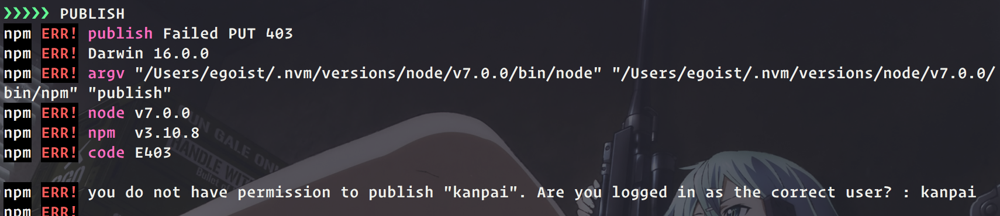

<p align="center">
  
</p>

<p align="center">
<a href="https://npmjs.com/package/kanpai"></a>
<a href="https://npmjs.com/package/kanpai"></a>
<a href="https://circleci.com/gh/egoist/kanpai"></a>
</p>

## How it works

**No black magic**. In [semantic-release](https://github.com/semantic-release/semantic-release) you don't have full control of project publish, `semantic-release` smartly analyze your commits and publish the corresponding new version.

While `kanpai` is, following this procedure:

- Check git status, see if you have committed the changes and if the remote history differs.
- Run tests, `npm test` by default, or `npm run kanpai` if this exists
- Update package version, add git tag as well
- Publish to NPM
- Push to remote git server

## Install

```bash
$ npm install -g kanpai

# or use yarn
$ yarn global add kanpai
```

## Usage

```bash
# default type is `patch`
$ kp
$ kp [patch|minor|major|$version|pre$type]

# custom test command, equal to npm run test:other
$ kp --test test:other

# only push to current working branch on remote
# after runing test script
$ kp --push-only

# skip test script
$ kp --skip-test

# more usages
$ kp -h
```

A common workflow:

```bash
# after hack something...
$ git commit -am "change the world"
$ kp
```

## Config

You can use command-line to set and get config globally:

```bash
$ kp get
$ kp get test

# update test
$ kp set test custom-test-script

# update the commit message when running `npm version `
# %s will be replaced by version number, eg: 0.1.0
$ kp set commitMessage "Release version %s"
```

You can config these properties in `package.json` for a single project:

```
{
  "kanpai": {
    "test": "lint", // custom test script => npm run lint
    "commitMessage": "Release version %s"
  }
}
```

## FAQ

### What if the `❯❯❯❯❯ PUBLISH` failed?



You can manually publish it when you fixed the issue:

```bash
npm publish
git push --follow-tags
```

### fatal: no upstream configured for branch 'master'

Two options:

a) `git branch --set-upstream-to=origin/master master` and then run `git push`<br>
b) `git push -u origin master`

## Preview

[](https://asciinema.org/a/aor622qgr9vplsq48rmkxzqxn)

## License

MIT © [EGOIST](https://github.com/egoist)
